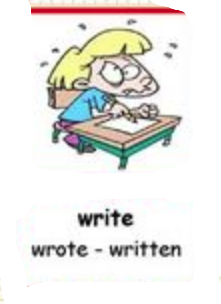

# storyboard
This application will help teachers of English deliver dynamic lessons to their students.

# tab adj noun reg verb

# tab tenses

# negotiation

# requirements
python3

pysimplegui

# thanks
Thanks go to Horst Jens who was instrumental in teaching me how to build this application. 